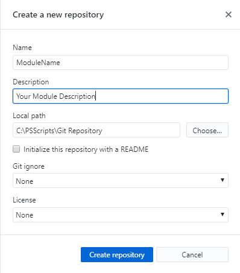
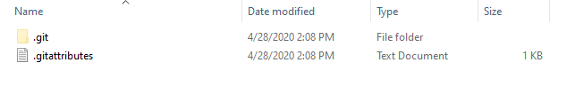
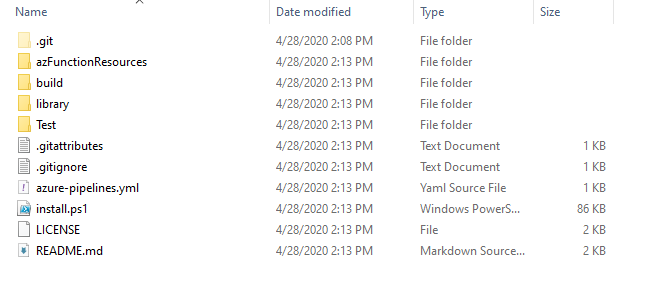

# PSFProject - Creating a Module Project

## Synopsis

Shows how to use the PSFProject template for a new PowerShell project, in a detailed step-by-step guide.

## Guidance

1. Create a local Repository Example `c:\PSScripts\Repository`
2. Install GitHub Desktop from here: [https://desktop.github.com/](https://desktop.github.com/)
3. In GitHub Desktop click File | Create a new repository

**IMPORTANT:** Directory must not already exist! If you have pre-created a directory for your code GitHub will throw an error.

Once GitHub creates your new module directory this is what it will look like.

4. Open a new PS window
5. Change directory to that folder "C:\PSScripts\Git Repository\YourModuleName" | cd
6. Run `imt PSFProject -NoFolder`

    > NOTE: imt is an alias for [Invoke-PSMDTemplate](../../../Commands/PSModuleDevelopment/Invoke-PSMDTemplate.md). Using the -nofolder will skip the folder creation because the folder has already been created by GitHub Desktop

7. Enter value for parameter 'name': YourModuleName
8. Enter value for parameter 'description': This is a test PowerShell module

Below is the output in the directory you will see after you invoke the creation of your new template. This template will be used for submitting your code to AzureDevOps for validation testing. You will want to do this before real work release of your code.

9. In explorer go up one directory to your Repositor and right click on your Test module folder and open in your programming application (VS Code, Visual Studio, etc.)
	
    > NOTE: Once your code is opened in your favorite developmental tool you can develop away until you have all of your code the way you like it. Since GitHub Desktop is already connected to your local code path all new code changes will be detected.

10. Once you are finished with your code you can save your code changes.
11. Commit your changes with your comments.
12. Lastly publish your code to your GitHub repository.

